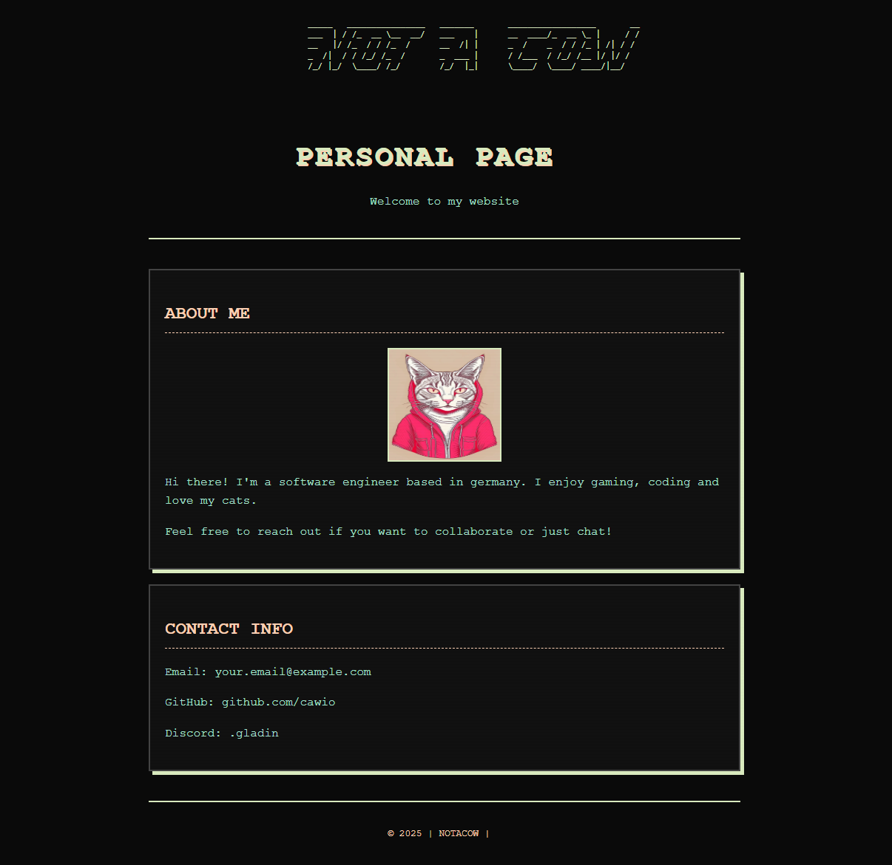

# NOTACOW Personal Website

A retro-styled personal website with a pastel color scheme.



## Features

- **Retro Aesthetic**: Pastel color palette on dark background with scanline effects
- **Responsive Design**: Works on desktop and mobile devices
- **Minimalist Layout**: Clean, card-based design with retro styling elements

## Contents

- Personal information section
- Contact details
- Customizable avatar
- Retro visual effects (scanlines, blinking cursor)

## Setup

1. Clone this repository:
   ```
   git clone https://github.com/cawio/notacow-personal-site.git
   ```

2. Replace the placeholder content:
   - Add your own avatar image (replace `avatar.png`)
   - Update personal information in the "About Me" section
   - Update contact information with your details
   - Uncomment and populate the Projects section if desired

## Customization

### Colors

The color scheme is defined using CSS variables in the `:root` selector:

```css
:root {
    --background: #0a0a0a;
    --text: #a8e6cf;
    --accent: #dcedc1;
    --secondary: #ffd3b6;
    --border: #444444;
    --card-bg: #111111;
}
```

Modify these values to change the color scheme throughout the site.

### Adding Sections

To add more content sections, copy the structure of the existing card divs:

```html
<div class="card">
    <h2>Section Title</h2>
    <!-- Your content here -->
</div>
```

## Future Enhancements

Potential future additions:
- Discord status integration (requires API setup)
- Dark/light mode toggle
- More interactive elements
- Blog or portfolio section

## Contact

For questions or suggestions, reach out via the contact information on the website.
